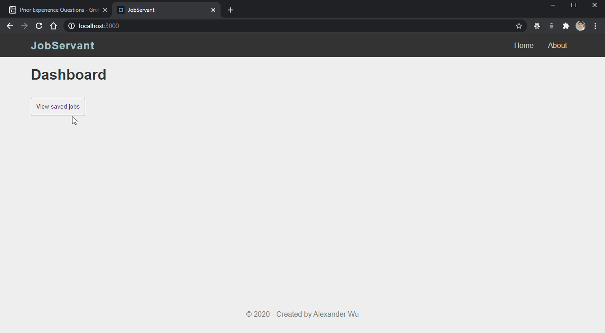

# Job Servant

**Goal:** AI-powered web app to organize the job search



(still a work in progress)

**Features:**

* Search saved jobs (w/ regular expressions)
* Keyword highlighting of job descriptions
* Links to job posting

**Upcoming features:**

* Recommend similar jobs (using tf-idf on keywords)
* Dashboard analytics
  * Jobs display on map (w/ mapbox)
  * Top requested skills and industries (w/ plotly.js?)
* Automated web scraping (w/ puppeteer) to update database
* Upload/edit resume ([JSON Resume](https://jsonresume.org/) format)
  * Recommend jobs based on `resume.json`
  * Automatically tailor resume to job posting
* Add/update/remove jobs

## Installation

Prerequisites

* [Node.js](https://nodejs.org/)
* [mongoDB](https://www.mongodb.com/)
* Web browser

In terminal, run these commands:

```sh
# Load data to database. Only run this once.
mongoimport --type csv -d jobservantDB -c jobs --headerline jobs.csv

npm install
npm run start
```
